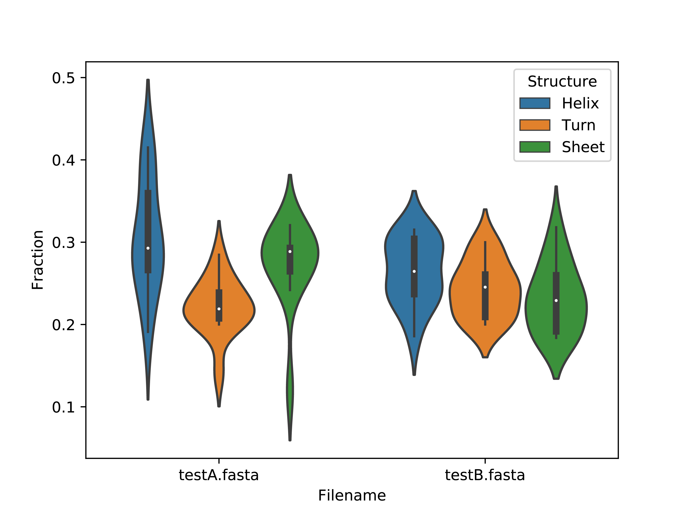
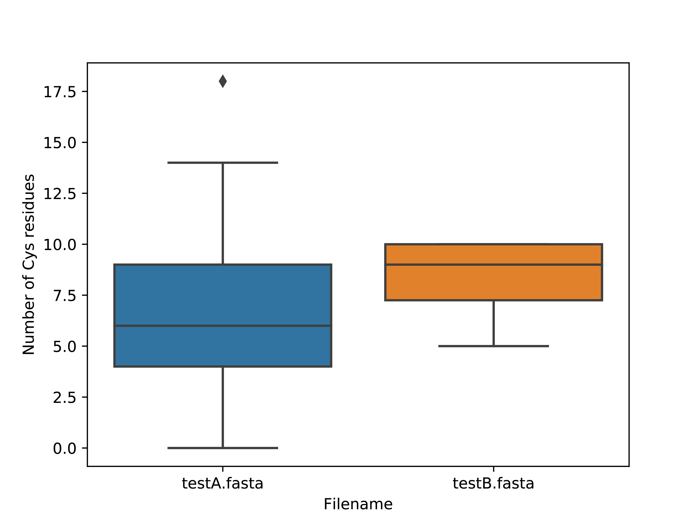
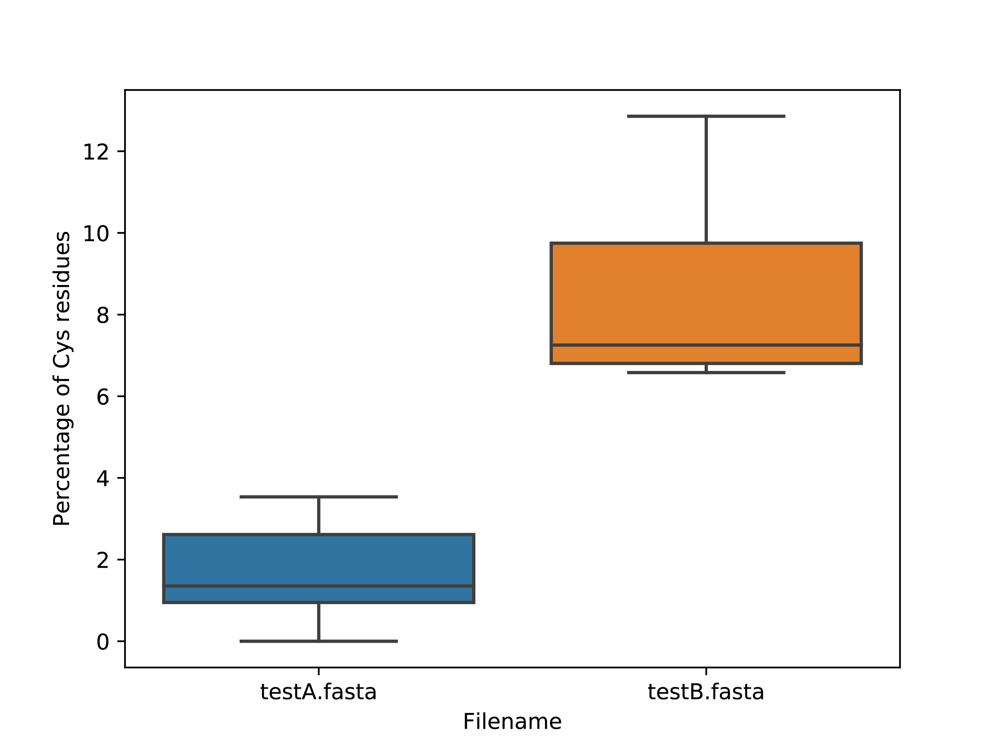

# CompareSequences

Generates plots to compare properties of protein sequences from two different FASTA files

Jamie McGowan, 2019

### Usage:
	
	python CompareSequences.py proteinsA.fasta proteinsB.fasta
	
49 plots are generated in the working directory in PDF format.

* Aromaticity
* Gravy index
* Instability index
* Isoelectric point
* Molecular weights
* Number of sequences
* Number of each amino acid residue
* Percentage of each amino acid residue
* Protein lengths
* Secondary structure fraction

### Requirements

- [Python](https://www.python.org/)
- [NumPy](https://numpy.org/)
- [Pandas](https://pandas.pydata.org/)
- [seaborn](https://seaborn.pydata.org/)
- [BioPython](https://biopython.org/)

### Example Plots

